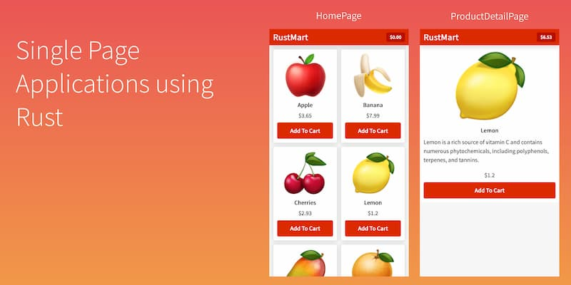

# Rust学习教程

- [如何使用 Rust 开发单页应用 SPA](http://www.sheshbabu.com/posts/rust-wasm-yew-single-page-application/)（英文）

单页应用（SPA）都是使用 JavaScript 开发，但是有了 WebAssembly 以后，其他语言也可以编译成 JavaScript。本文就完全使用 Rust 语言开发上图的 SPA，后端开发者现在也可以写前端了

- https://blog.codecentric.de/en/2020/09/rust-for-java-developers/

  使用java作为盒子,学习rust

- https://codeburst.io/learning-rust-by-contrasting-with-typescript-part-1-afb2e3f6ead8

  使用typescript作为例子,学习Rust语言

  

- https://github.com/Mercateo/rust-for-node-developers

  使用 node 作为例子，学习Rust 语言。

  

- [写给 JavaScript 程序员的 Rust 教程](http://www.sheshbabu.com/posts/rust-for-javascript-developers-functions-and-control-flow/)（英文）

一组系列文章，使用 JavaScript 作为例子，介绍 Rust 语言。

- [sonic](https://github.com/valeriansaliou/sonic)

一个 Rust 语言写的搜索服务器，可以用作 Elasticsearch 的替代品

- [RustPrimer](https://rustcc.gitbooks.io/rustprimer/content/)

- [如何写一个脚本语言的虚拟机？](https://blog.subnetzero.io/post/building-language-vm-part-00/)（英文）

  这组系列文章介绍脚本语言的运行虚拟机（VM）怎么写。

- [电子书] [A Gentle Introduction To Rust](https://stevedonovan.github.io/rust-gentle-intro/readme.html)

  Rust 语言入门教程

