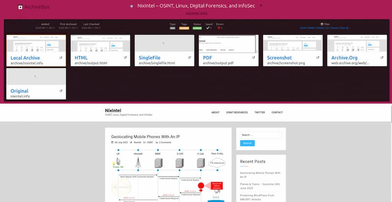
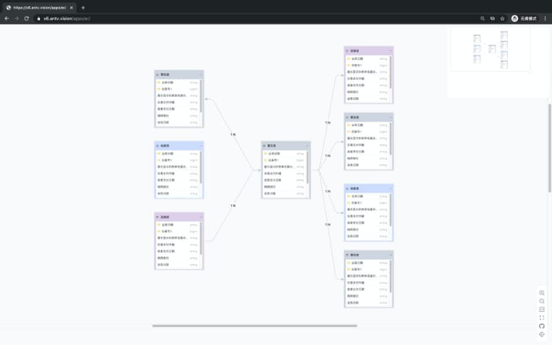

# 有用网站收藏:

## 云服务相关

- [我如何建立自己的 Kubernetes 集群](https://blog.quickbird.uk/domesticating-kubernetes-d49c178ebc41)（英文）

作者先介绍了 Kubernetes 的概念（分布式基础设施之上的虚拟系统层），然后介绍如何家用老电脑（上图）组建一个集群。

- [图灵派](https://turingpi.com/)（Turing Pi）

图灵派是树莓派的一个集群板，好比机房里面的一个机架，可以用来自己架设 Kubernetes 集群

- [deploy-your-own-saas](https://github.com/Atarity/deploy-your-own-saas)

## 计算机科学

- [Build your own x](https://github.com/danistefanovic/build-your-own-x)

这个仓库专门收集各种教程，教你如何自己实现各种软件，比如 Web 服务器、BT 下载客户端、Git、数据库等等。

- [RegExper](https://regexper.com/)

该网站可以将正则表达式转成解释图片。

- [Compiler Explorer](https://godbolt.org/)

一个在线的编译器学习工具，可以显示高级语言对应的汇编代码，支持多种语言

- [seafox](https://github.com/KFlash/seafox)

一个 TypeScript 写的 JavaScript 解析器，也就是说使用 JavaScript 解析 JavaScript，支持最新的 ES2020 语法

- [regex](https://github.com/xindoo/regex)

一个示例项目，从0开始，使用 Java 实现一个正则表达式引擎，核心代码只有200多行，用来学习编译原理

## 操作系统相关

- [AntzOS](https://github.com/CasterWx/AntzOS)

一个用于实验和教学目的的操作系统，从零开始实现

## 源码工具:

- [如何自己实现一个全文搜索引擎](https://artem.krylysov.com/blog/2020/07/28/lets-build-a-full-text-search-engine/)（英文）

作者通过一个简单的例子，讲解全文搜索引擎的原理，自己如何实现倒排索引。举例用的是 Go 语言，代码很简单，接近伪代码

- [Vim Adventure](https://vim-adventures.com/)

  

  通过游戏学习 Vim，看上去比较有趣

## 算法与数据结构

- [如何写一个最简单的 React 实现](https://zserge.com/posts/worst-react-ever/)（英文）

作者讲解如何自己实现一个最简单的 React，支持 JSX 语法和一些基本 API，压缩后代码不超过 1KB。本文可以用来了解 React 原理。

- [Raft 共识的动画讲解](http://thesecretlivesofdata.com/raft/)

通过一步步的动画，讲解 Raft 协议如何保证分布式集群的一致性，以及选举 leader 的过程。

- [哈希算法的种类](https://pradeeploganathan.com/blockchain/hashing/)（英文）

这篇文章用相对通俗的语言，介绍了目前常用的几种哈希算法，以及它们各自适用的场景

- [设计模式](https://refactoringguru.cn/design-patterns)

该网站为中文教程，使用通俗的语言，介绍各种设计模式，图文并茂。此外，还有代码重构方面的英语内容

- [JavaScript 的迷宫生成算法](https://medium.com/swlh/how-to-create-a-maze-with-javascript-36f3ad8eebc1)（英文）

本文介绍如何用 JavaScript 生成一个迷宫，写得很容易懂，每一步都有示例

- [Visu Algo](https://visualgo.net/zh)

各种算法的动态演示网站

- [algorithm-visualizer](https://github.com/algorithm-visualizer/algorithm-visualizer)

一个直观的算法可视化工具，你可以自由选择自己想学习的算法，每个算法它都清晰描绘了其原理和运作过程。

- [LeetCode Animation](https://github.com/MisterBooo/LeetCodeAnimation)

使用动画的形式呈现解 LeetCode 题目的思路

- [数据结构可视化](https://www.cs.usfca.edu/~galles/visualization/Algorithms.html)

该网站收集各种数据结构，并将它们用可视化的形式表现出来。

## 机器学习/操作

- [volute](https://github.com/webfansplz/volute)

一个语音工具的集成软件，文档教你如何在树莓派上使用 Node.js，搭建自己的语音助手，可以识别语音，也可以将文本转为语音。

- [Headless recorder](https://github.com/checkly/headless-recorder)

一个 Chrome 浏览器插件，自动记录你的操作，转成 Puppeteer 或 Playwright 脚本，从而实现浏览器操作自动化。

- [没有博士学位者的 TensorFlow 和深度学习教程](https://codelabs.developers.google.com/codelabs/cloud-tensorflow-mnist/)

谷歌发布的英文教程，没有高深的数学，向初学者介绍 TensorFlow 和深度学习

- [EasyOCR](https://github.com/JaidedAI/EasyOCR)

一个开源的 OCR 软件，支持识别40种语言，包括中日韩文字

- [robotjs](https://github.com/octalmage/robotjs)

一个 Node.js 的桌面自动化脚本库，支持 Mac、Windows 和 Linux

- [shan-shui-inf](https://github.com/LingDong-/shan-shui-inf)

一个自动生成中国山水画的 JS 实现

- [换脸视频生成服务](https://myvoiceyourface.com/)

一个在线服务，用户可以上传一张照片和一段视频，网站会将照片里的人脸，替换视频里面的人脸

- [简单粗暴 TensorFlow 2](https://tf.wiki/)

这是一本简明的 TensorFlow 2 入门指导手册的中文版翻译，力图让具备一定机器学习及 Python 基础的开发者们快速上手 TensorFlow 2

- [使用树莓派自制热像仪](https://medium.com/sausheong/build-a-thermal-camera-with-raspberry-pi-and-go-8f70451ad6a0)（英文）

作者介绍自己如何使用树莓派，制造了一个便宜的热像仪，可以感知人群中体温偏高的人

- [tesseract.js](https://github.com/naptha/tesseract.js)

一个 JavaScript 语言的 OCR 库，可以在网页运行，识别图片中的文字。它支持100多种文字，包括中文。这里还有[一篇教程](https://nanonets.com/blog/ocr-with-tesseract/)，介绍 Python 语言如何使用这个库。

- [Hammerspoon](https://www.hammerspoon.org/)

Mac 电脑的自动化操作工具，使用 Lua 语言编写脚本。

- [机器学习漫画](https://cloud.google.com/products/ai/ml-comic-1/)

谷歌推出的机器学习漫画，解释基本知识

- [Automagica](https://github.com/oakwoodai/automagica)

一个跨平台的桌面自动化工具，可以编写脚本，自动执行桌面操作。

- [tesseract.js](https://github.com/naptha/tesseract.js)

一个可以完成 62 种语言 OCR （光学识别）的 JS 库

- [树莓派的项目](https://hackaday.io/projects?tag=raspberry pi)

该网站收集各种树莓派的项目，目前已经有1000多项了。

- [puppeteer-recorder](https://chrome.google.com/webstore/detail/puppeteer-recorder/djeegiggegleadkkbgopoonhjimgehda)

  Chrome 插件，可以将用户在浏览器里面的操作，自动生成对应的 Puppeteer 脚本。

- [Basic Engine](https://basicengine.org/)

  

  这是一个开源的低成本单板电脑，可以在家里自己制造。

- [火星车](https://github.com/nasa-jpl/open-source-rover)

  

  美国航天局 NASA 开源了火星车的简化版本，它的原型是真正的火星漫游车。据说这个项目全部采用市面能买到的材料，爱好者可以搭建自己的火星车。

  

  

## 编程相关教程

### 汇编语言

- [x86-64 汇编语言入门教程](http://briansteffens.com/introduction-to-64-bit-assembly/01-hello-world/)（英文）

本文通过运行一个最简单的 hello world 实例，介绍汇编语言的基本概念

- [PC Assembly Language](https://pacman128.github.io/pcasm/)

介绍汇编语言的本科生入门教材，有中文译本，免费下载。

- [ARM 汇编语言简介](http://bob.cs.sonoma.edu/IntroCompOrg-RPi/intro-co-rpi.html)

通过树莓派介绍 ARM 汇编语言的开源教材

### 编译器/解析器

- [编译器基础](http://notes.eatonphil.com/compiler-basics-lisp-to-assembly.html)（英文）

本文用 JavaScript 语言演示如何写解析器，将代码转为抽象语法树 AST，然后再写编译器，将其转为汇编语言。

[用 JS 写一个 JS 解释器](https://juejin.cn/post/6898093501376905230)（中文）

本文解释了 JS 解释器如何将源代码转换成 AST（抽象语法树），并给出了一个简单的、便于理解的解释器实现。

- [TypeScript 写一个词法解析器](https://areknawo.com/the-lexer-in-js/)（英文）

词法解析器（lexer）的作用是将源码转成一个个词元（token），本文介绍如何用 TypeScript 写一个简单的解析器。

### 调试工具/面试

- [电子书] [Google 面试自学手册](https://github.com/jwasham/coding-interview-university/blob/master/translations/README-cn.md) 一份爱好者整理的 Google 面试准备指南。

- [文章] [Chrome DevTools 的一些使用技巧](https://flaviocopes.com/chrome-devtools-tips/#drag-and-drop-in-the-elements-panel)

###   go语言教程

- [最简单的反向代理服务器](https://hackernoon.com/writing-a-reverse-proxy-in-just-one-line-with-go-c1edfa78c84b)（英文）

  本文介绍如何用 Go 语言实现一个最简单的反向代理服务器。

  

- [Go101](https://go101.org/)（英文）

  *Go 101 *是一本介绍 Go 语言的语法和各种细节的开源电子书，帮助读者深入彻底地了解 Go。

- [Go 语言风格规范](https://github.com/uber-go/guide/blob/master/style.md)

  Uber 公司开源了该公司的《Go 语言风格规范》
  
  
  

###   Rust学习教程

- [如何使用 Rust 开发单页应用 SPA](http://www.sheshbabu.com/posts/rust-wasm-yew-single-page-application/)（英文）

单页应用（SPA）都是使用 JavaScript 开发，但是有了 WebAssembly 以后，其他语言也可以编译成 JavaScript。本文就完全使用 Rust 语言开发上图的 SPA，后端开发者现在也可以写前端了

- [写给 JavaScript 程序员的 Rust 教程](http://www.sheshbabu.com/posts/rust-for-javascript-developers-functions-and-control-flow/)（英文）

一组系列文章，使用 JavaScript 作为例子，介绍 Rust 语言。

- [sonic](https://github.com/valeriansaliou/sonic)

一个 Rust 语言写的搜索服务器，可以用作 Elasticsearch 的替代品

- [RustPrimer](https://rustcc.gitbooks.io/rustprimer/content/)

- [如何写一个脚本语言的虚拟机？](https://blog.subnetzero.io/post/building-language-vm-part-00/)（英文）

  这组系列文章介绍脚本语言的运行虚拟机（VM）怎么写。

  

  

### Java/kotlin

- [node-jvm](https://github.com/YaroslavGaponov/node-jvm)

一个用 Node.js 实现的 JVM，实现的非常简洁清晰，方便学习

- [JCSprout](https://github.com/crossoverJie/JCSprout)

一个收集 Java 核心知识的中文库。

- [crontab 编辑器](https://crontab.guru/)

  crontab 是 Linux 系统的定时任务执行器。这个在线工具可以可视化生成 crontab 的配置文件。

  

  

### WEB前端相关

- [H5-Dooring](https://github.com/MrXujiang/h5-Dooring)

一个可视化制作 H5 页面的在线工具

- [Sharkle](https://sharkle.com/)

点击网页上的按钮，它会随机打开一个有趣codepen.io的特效。

- [Coded Mails](https://codedmails.com/)

电子邮件的 HTML 模版很难写，因为客户端有着各种限制。该网站提供各种主题的响应式电子邮件模版下载

- [KakaCSS](https://renzhezhilu.gitee.io/kakacss/)

在任意网站复制内容，粘贴到这个网站，会给出所复制内容的 CSS 样式代码

- 、[CSS 3D 示例](https://polypane.app/css-3d-transform-examples/)

该网页收集一些常用 CSS 3D 示例。

- [Flexbox Defense](http://www.flexboxdefense.com/)

一个在线的塔防小游戏，通过 CSS Flexbox 的练习，击退一波波进攻的敌人。

- [visx](https://airbnb.io/visx/)

Airbnb 推出的一套数据可视化组件库，基于 D3 和 React。

- [10个你可能不知道的 Web API](https://blog.greenroots.info/10-lesser-known-web-apis-you-may-want-to-use-ckejv75cr012y70s158n85yhn)（英文）

Chrome 浏览器提供的 Web API 非常多，本文介绍其中10个。

- [ts-migrate](https://github.com/airbnb/ts-migrate)

Airbnb 公司新的开源项目，可以将 JavaScript 代码转成 TypeScript 代码

[React Spectrum](https://react-spectrum.adobe.com/react-spectrum/index.html)

Adobe 公司的 React 组件库，用法非常简单干净。

- [Scroll to text fragment 生成器](https://github.com/chunliu/sttf-url-generator)

Chrome 浏览器的扩展，可以对选中的网页文字，生成一个 URL。其他用户访问这个 URL，打开网页后，就会自动滚动到这段文字。它的原理是使用了 Chrome 浏览器的新功能 scroll to text fragment

- [CSS 三角形生成器](https://www.dute.org/css-arrow)

使用 CSS 生成三角形是网页设计常见的需求，比起使用图片，CSS 生成的三角形具有更好的可控性和灵活性。本工具支持自定义三角形大小、颜色、方向、边框等属性

- [如何在 Node.js 环境安装 Selenium](https://dev.to/oyetoket/how-to-setup-selenium-on-node-environment-30bc)（英文）

Selenium 是通用的浏览器测试框架，本文介绍如何在 Node.js 里面使用它

- [react-visual-editor](https://github.com/anye931123/react-visual-editor)

React 的组件可视化拖拽页面编辑与代码生成工具，让不会 React 技术栈的人员可以通过拖拽生成页面。

- [如何自己实现一个 React 框架](https://pomb.us/build-your-own-react/)（英文）

本文一步步用简单的代码讲解，如何自己从头实现 React 框架

- [HTTP Toolkit](https://httptoolkit.tech/mock/)

这个工具可以拦截和查看 HTTP/HTTPS 请求,像finlder,charles

- [如何学习 D3.js](https://wattenberger.com/blog/d3#intro)

数据可视化库 D3.js 的在线英文教程

- [数字雨](https://codepen.io/yuanchuan/pen/YoqWeR)

浏览器还原电影《黑客帝国》的数字雨，链接为 Codepen.io 演示

- [cleave.js](https://github.com/nosir/cleave.js)

一个对输入框中用户输入的内容，进行格式化的 JS 库

- [Flexbox布局详解](https://github.com/veedrin/horseshoe/blob/master/flex/%E4%B8%80%E7%BB%B4%E5%B8%83%E5%B1%80%E6%A8%A1%E5%9E%8BFlex.md)

- [前端开发技术日报](https://github.com/kujian/frontendDaily)

- [Reactide](http://reactide.io/)

Reactide 是 React Web 应用开发的专用 IDE。

- [GoJS](https://github.com/NorthwoodsSoftware/GoJS)

GoJS 是一个功能丰富的 JS 库，用于在浏览器上实现自定义交互式图表和复杂的可视化图表。

- [如何写一个模块打包器](https://adamisntdead.com/lets-write-a-module-bundler/)（英文）

  Webpack 是现在最流行的模块打包器，可以将脚本依赖打包成一个文件。这到底是怎么实现的？如果自己写一个打包器，应该怎么写？

- [字体文件转成css3文件](https://transfonter.org/)

  

- [React Hooks Form](https://github.com/react-hook-form/react-hook-form)

  这是一个 React 表单库，基于 React Hooks，看上去代码相当简洁，star 也很高，也许以后可以摆脱那些笨重的表单组件了

  

  

### 翻译工具

- [pronounce](https://github.com/filipeisho/pronounce)

一个开源的浏览器插件，只要双击网页上的单词，就能听到这个词的发音，支持各种语言。

- [Lingocloud – 彩云小译-双语对照翻译插件！](https://chrome.google.com/webstore/search/LingoCloud?utm_source=chrome-ntp-icon)
- "谷歌翻译"

"谷歌翻译"。它有一个"对话实时翻译"功能，可以同时监听两种语言，听到中文就自动说出日语，听到日语就说出中文。我试了一下，翻译效果之好令人震惊，完全是真人发音，翻译非常准确。建议大家也装一个玩玩，亲身体验自己说出的话变成流利的日语，肯定能震撼到你。

两个人同时对着手机说话，还是比较尴尬的，因此谷歌还推出了 Buds 蓝牙耳机。你说出的话通过耳机的话筒传入手机，让手机播放翻译好的版本给对方听。对方的回应被翻译以后，再通过耳机传给你。这样的话，对话可以始终是面对面。

- 、[CopyTranslator](https://github.com/elliottzheng/CopyTranslator/blob/master/README_zh.md)

PDF 文件即时翻译工具。只要选中 PDF 文件里面的文字，就自动调用谷歌翻译的 API，将其翻译成中文，粘贴出来就是中文。

## 资源

- [Vimium 插件的使用方法](https://codefaster.substack.com/p/look-ma-no-mouse-vimium)（英文）

Vimium 是 Chrome 浏览器的一个插件，可以只用键盘来操作网页，本文是它的教程。

- [谷歌搜索的10个小技巧](https://medium.com/@shalithasuranga/10-hidden-features-in-google-search-83b347b48157)（英文）

- [isoflow](https://isoflow.io/)

一个绘制示意图的在线工具

- [avatarify](https://github.com/alievk/avatarify)

一个开源软件，只需要提供一张头像照片，就可以生成人物开口讲话的视频

- [GitHub 的10个使用小技巧](https://github.blog/2020-04-09-github-protips-tips-tricks-hacks-and-secrets-from-lee-reilly/)

官方介绍10个 GitHub 使用小技巧，很实用，推荐阅读

- [浏览器在 2020 年可以干什么？](https://github.com/luruke/browser-2020/blob/master/README.md)

这个仓库收集各种新兴的浏览器 API，展示浏览器具备的能力。如果你想追踪 Web App 开发的前沿，可以关注它。上图是浏览器的画中画 API

- [jira_clone](https://github.com/oldboyxx/jira_clone)

使用 React + Node.js 写的项目管理工具 Jira 的克隆

- [Nototo](https://www.nototo.app/)

一个思路很新颖的笔记软件，以可视化的方式做笔记，目前只有 Web 版。一条笔记就是新建一块地，一个目录就是新建一个岛屿，打标签就是新建建筑物

- [Killersheep](https://github.com/vim/killersheep)

一个 Vim 游戏，主要目的是展示 Vim 8.2 的新功能

- [video-object-removal](https://github.com/zllrunning/video-object-removal)

这个工具使用机器学习算法，去除视频里面的运动物体

- [hostyoself](https://github.com/schollz/hostyoself)

一个开源工具，可以架设服务，连接本地计算机，让其他人可以通过互联网访问本地的文件夹和文件

- [如何用 Puppeteer 破解滑块验证](https://medium.com/@filipvitas/how-to-bypass-slider-captcha-with-js-and-puppeteer-cd5e28105e3c)（英文）

很多网站现在都有滑块验证，识别用户是否为真人。但是，其实它们都可以用 Puppeteer 的自动化脚本破解，本文展示怎么做到这一点。

- [如何使用 AWS S3 和 Cloudflare 托管免费网站](https://medium.com/better-programming/how-to-host-your-personal-website-for-free-3101c4ab2e49)（英文）

本文一步步介绍如何将静态网站托管在 AWS S3 上面，然后用 Cloudflare 建立 CDN，这都是免费的

- [SoloPi](https://github.com/alipay/SoloPi)

支付宝推出的安卓应用自动化测试工具。公测版拥有录制回放、性能测试、一机多控三项主要功能，能为测试开发人员节省宝贵时间

- [谷歌表格的27个诀窍](https://www.fastcompany.com/90334451/27-incredibly-useful-things-you-didnt-know-google-sheets-could-do)（英文）

谷歌表格（Google Sheet）的功能非常强大，本文介绍27个很有用、但是你可能不知道的使用诀窍

- [你应该记住的 DNS 地址](https://danielmiessler.com/blog/dns-servers-you-should-have-memorized/)（英文）

作者介绍了几个常用的 DNS 服务器地址，简单谈了它们之间的差异

- [public-apis](https://github.com/toddmotto/public-apis)

这个仓库收集免费的 API，

- [科技资讯的聚合网站](https://github.com/ruanyf/weekly/issues/259)

该网页聚合多个英文科技咨询网站的消息，一个地方就能看到所有资讯

- [日本农村待售的房屋](https://inakanoseikatsu.com/山口県山口市・古民家・70万円/)

看看日本乡下，几万元人民币可以买到的房子一大堆，都是买来就可以直接入住，还带土地产权。

- 

- [收集对开发人员有用的定律、理论、原则和模式，比如摩尔定律、侯世达定律、墨菲定律等等](https://github.com/nusr/hacker-laws-zh)

- [Crontab UI](https://www.ostechnix.com/how-to-easily-and-safely-manage-cron-jobs-in-linux/)

  

  cron 是设置 Linux 系统定时任务的工具，只能在命令行下使用。现在，这个软件为它提供了图形界面。

- [Puppeteer 网页爬虫和自动化测试教程](https://github.com/csbun/thal)（中文）

  想要学习浏览器自动化的同学，可以看看这篇中文教程。

- [模拟电路生成器](https://www.falstad.com/circuit/circuitjs.html)

  生成模拟电路的网站。

- [在 Google Bucket 托管静态网站](https://stephenmann.io/post/hosting-a-hugo-site-in-a-google-bucket/)（英文）

  静态网站可以免费托管在很多地方，现在又多了一个选择：谷歌的云服务。这篇文章教你怎么做。

- [如何破解路由器？](https://blog.websecurify.com/2018/06/router-hacking.html)（英文）

  一份简单的教程，如何获得局域网路由器的 root 权限。

- [逆向工程初学者教程](https://www.begin.re/)（英文）

  向初学者介绍逆向工程的知识

  

- [电子书] [D3 Graph Theory](https://mrpandey.github.io/d3graphTheory/index.html)

  图理论（graph theory）是重要的数学分支，在数据处理领域有着重要应用。这个教程采用可视化库 D3，把图理论变成了可视化互动教程

  

- [Node.js 编程最佳实践](https://github.com/goldbergyoni/nodebestpractices)

- [node best practices](https://github.com/i0natan/nodebestpractices)

  一个收集 Node 最佳实践的仓库。

- [free-for.dev 该仓库收集各种可以免费使用的（或有免费层的）互联网服务](https://free-for.dev/)

- [navi](https://github.com/denisidoro/navi)

  一个命令行的交互式备忘工具，你可以查阅某个命令的作用。

  
  
  [Amazon Sidewalk 协议](https://techcrunch.com/2019/09/25/amazon-sidewalk-is-a-new-long-range-wireless-network-for-your-stuff/)
  
  
  
  亚马逊公司提出，现有的无线通信协议都不理想：蓝牙和Wi-Fi 的覆盖范围太小，5G 的功耗太大且过于复杂。因此，它发明了一种新无线协议，叫做 Amazon Sidewalk。
  
  这种协议使用900兆赫频率，特点是低带宽、长距离（通信距离可以到一英里），设计用途是连接房屋内部和周围的所有物联网设备。
  
  亚马逊已经在洛杉矶发送了700台测试设备。一旦有大量接入点，可以创建覆盖面非常广的网络。
  
  
  
  第一款使用该协议的产品，将是明年发售的狗牌 Ring Fetch。狗戴着这个设备，一旦失去信号，就表示狗已经远离了你，你就会收到警报。只要收到信号，就表示狗在距离你一英里的范围内
  
  

[ArchiveBox](https://github.com/ArchiveBox/ArchiveBox)

一个将网页存档的工具，可以将 HTML、CSS、JS、图片、媒体文件都保存下来，供日后查看。这里是[教程](https://nixintel.info/osint-tools/make-your-own-internet-archive-with-archive-box/)。

[X6](https://x6.antv.vision/zh)

蚂蚁集团数据可视化工具 AntV 旗下的图编辑引擎，用来在网页上生成 SVG 图形。（[@NewByVector](https://github.com/ruanyf/weekly/issues/1615) 投稿）

[Supercookie](https://github.com/jonasstrehle/supercookie)

越来越多的浏览器限制使用 Cookie，这个库演示了如何使用网页图标 Favicon 来追踪用户，效果惊人