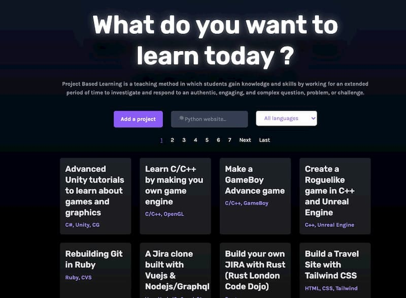
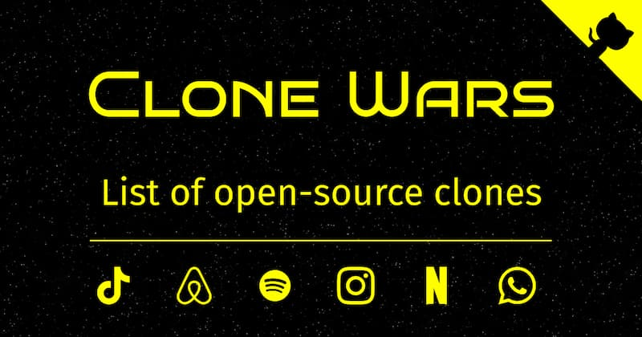
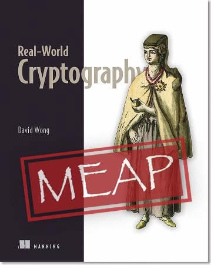
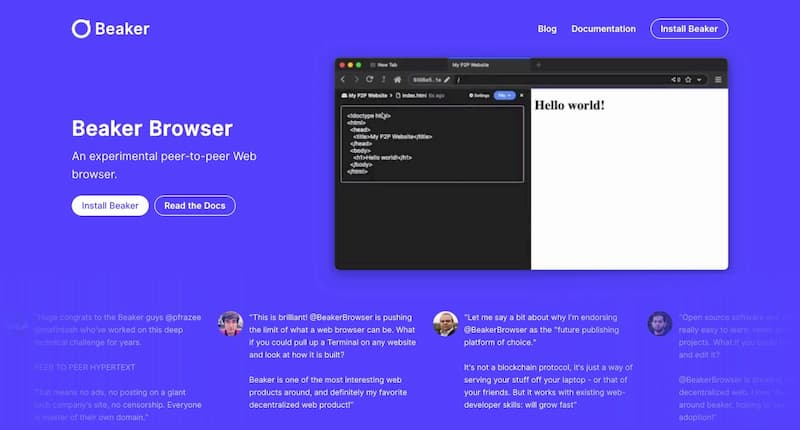
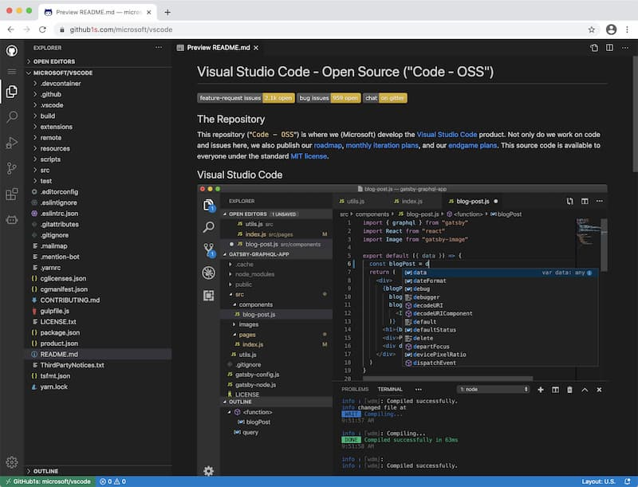
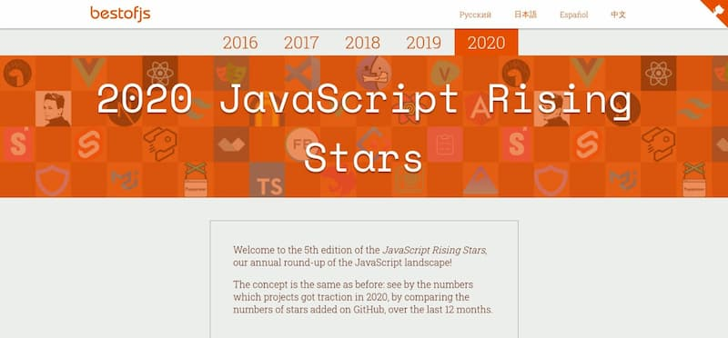

# 重要的学习方向:

[Learn X by doing Y](https://aquadzn.github.io/learn-x-by-doing-y)

这个网站收集以学习为目的各种实战教程（比如自己动手写数据库、编译器等等），按照计算机语言进行分类，帮助读者快速查找可以自己动手做的简单项目

[Clone Wars](https://github.com/GorvGoyl/Clone-Wars)

该仓库收集热门网站的开源实现，比如 Airbnb、Amazon、Instagram、Netflix、Tiktok、Spotify 等，已经有70多个项目了。

[真实世界的密码学](https://www.manning.com/books/real-world-cryptography)（Real-world Cryptography）

本书使用简单的语言和示例，解释了普通用户在日常生活中遇到的密码学问题，可以免费在线阅读。

# 工具:

1、[Beaker](https://beakerbrowser.com/)

一个实验性浏览器，提供点对点访问。你可以在浏览器里面架设自己的网站，然后让其他人访问它。

2. [github1s](https://github.com/conwnet/github1s)

只要在 GitHub 仓库域名后面加上`1s`，比如`github1s.com/facebook/react`，就能在浏览器里面使用 VS Code 环境，浏览这个仓库的代码。

## 资源

 [写给文科生的数学](https://courses.lumenlearning.com/waymakermath4libarts/)（Mathematics for the Liberal Arts）

一本在线阅读的英文教科书，向文科生介绍数学知识，涉及逻辑学、图论、概率论等，但是不涉及微积分。

[2020年崛起的 JavaScript 新工具](https://risingstars.js.org/2020/en)

这是每年一度的调查，根据过去一年中 GitHub 新增的 Star 数量，对各个领域的 JavaScript 工具进行排名，可以快速掌握新出现的主流工具。